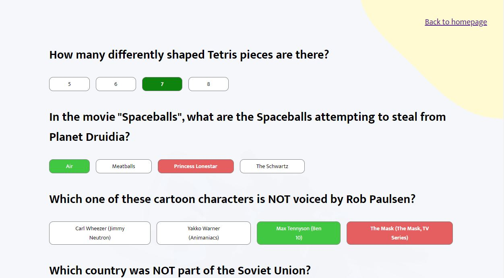
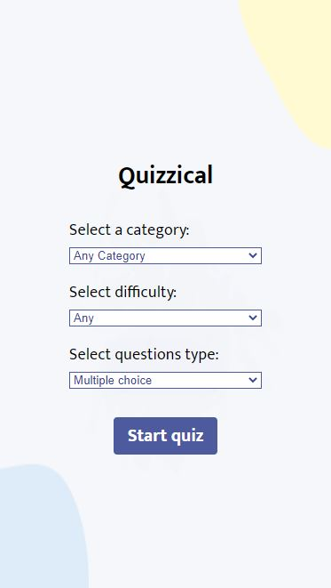

# Quizzical - Quiz App

Test your knowledge in 25 different categories with this awesome Quizzical app. You get five questions every time, you can choose difficulty, as well as answers between multiple choice and true/false type of questions. Result is being displayed in the end, and you can see which answers you got right.

## Table of contents

- [Overview](#overview)
  - [Screenshot](#screenshot)
  - [Links](#links)
- [Process](#process)
  - [Built with](#built-with)
  - [Useful resources](#useful-resources)
- [Author](#author)

## Overview

Users should be able to:
- choose a category between 25 different ones
- choose the difficulty of the quiz (easy, medium or hard)
- choose if they want multiple choice answers or true/false type of quiz
- change their answers before checking them
- see their result and all the correct answers, whether they guessed them right or not

### Screenshot

Desktop and mobile design of Quizzical App.

### Links

- Live Site URL: [Quizzical](https://jelenkoo10.github.io/quizzical/)

## Process

### Built with

- Semantic HTML5 markup
- CSS custom properties
- Flexbox
- CSS Grid
- Mobile-first workflow
- [React](https://reactjs.org/) - JS library
  - React Router
  - React Context

### Useful resources

- [Deploying React app with routing on GitHub Pages](https://stackoverflow.com/questions/71984401/react-router-not-working-with-github-pages) - Since it's my first time that I included routing in one of my projects, I had problems with deploying. Here in the link, you can find the way to solve this. Also, don't forget to put 'basename' attribute in HashRouter (<HashRouter basename="/">)!

## Author

- GitHub - [https://github.com/jelenkoo10](https://github.com/jelenkoo10)
- Frontend Mentor - [@jelenkoo10](https://www.frontendmentor.io/profile/jelenkoo10)
- LinkedIn - [Veljko Jelenković](https://www.linkedin.com/in/veljko-jelenkovi%C4%87-182981250/)